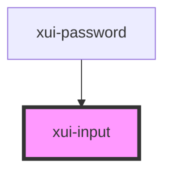

# xui-input

<!-- Auto Generated Below -->

## Properties

| Property      | Attribute     | Description | Type                                              | Default     |
| ------------- | ------------- | ----------- | ------------------------------------------------- | ----------- |
| `disabled`    | `disabled`    |             | `boolean`                                         | `undefined` |
| `name`        | `name`        |             | `string`                                          | `undefined` |
| `placeholder` | `placeholder` |             | `string`                                          | `undefined` |
| `prefixes`    | --            |             | `((input: HTMLXuiInputElement) => HTMLElement)[]` | `[]`        |
| `state`       | `state`       |             | `"active" \| "focus" \| "hover" \| "normal"`      | `'normal'`  |
| `suffixes`    | --            |             | `((input: HTMLXuiInputElement) => HTMLElement)[]` | `[]`        |
| `type`        | `type`        |             | `string`                                          | `undefined` |
| `value`       | `value`       |             | `number \| string`                                | `undefined` |

## Dependencies

### Used by

 - [xui-password](..\password)

### Graph

----------------------------------------------

*Built with [StencilJS](https://stenciljs.com/)*
