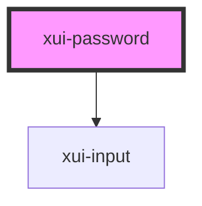

# xui-password

<!-- Auto Generated Below -->

## Properties

| Property      | Attribute     | Description | Type               | Default     |
| ------------- | ------------- | ----------- | ------------------ | ----------- |
| `disabled`    | `disabled`    |             | `boolean`          | `undefined` |
| `name`        | `name`        |             | `string`           | `undefined` |
| `placeholder` | `placeholder` |             | `string`           | `undefined` |
| `readable`    | `readable`    |             | `boolean`          | `undefined` |
| `value`       | `value`       |             | `number \| string` | `undefined` |

## Dependencies

### Depends on

- [xui-input](..\input)

### Graph

----------------------------------------------

*Built with [StencilJS](https://stenciljs.com/)*
